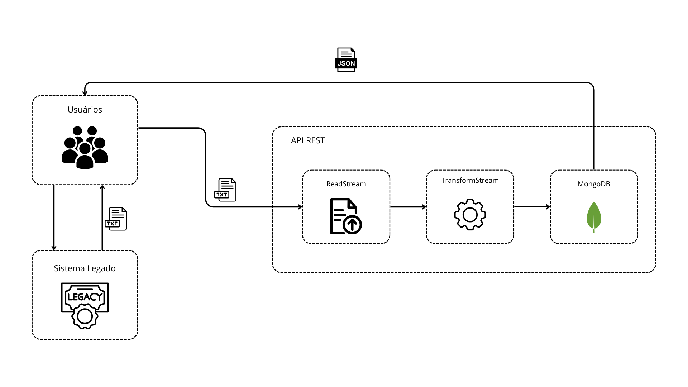
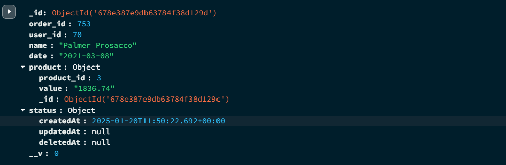
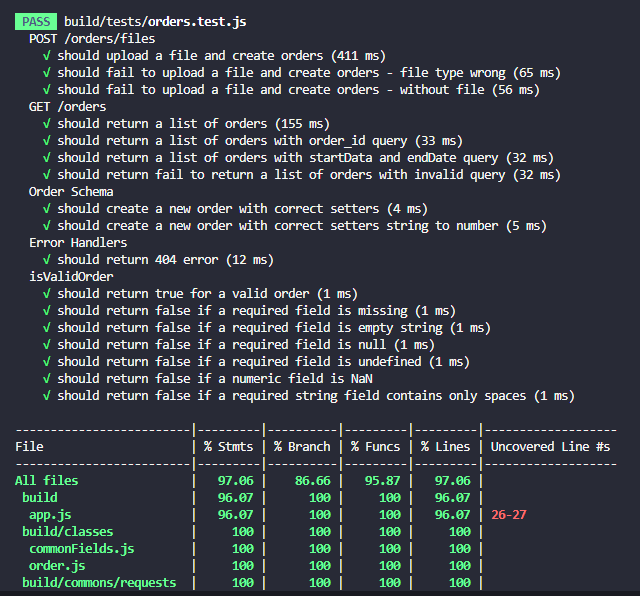
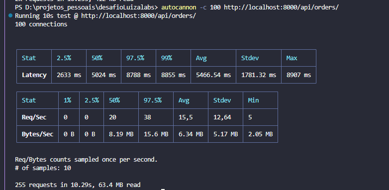
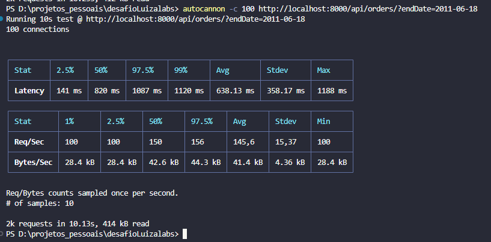

# Desafio Vertical Logística - Node.js

## Sumário
1. [Descrição da Solução](#1---descrição-da-solução)
2. [Linguagem](#2---linguagem)
3. [Banco de Dados](#3---banco-de-dados)
4. [Arquitetura](#4---arquitetura-utilizada)
5. [Bibliotecas](#5---ferramentas-e-frameworks-utilizados)
6. [Modelagem](#6---modelagem-dos-dados)
7. [Como Rodar](#7---como-rodar-localmente-e-por-docker)
8. [Testes](#8---testes)
8. [Documentação](#9---documentação)


## 1 - Descrição da Solução
Esta REST API foi criada para mostrar um pouco a minha forma de resolver problemas do cotidiano em Node.js.
Trata-se da resolução do desafio técnico da Vertical Logística do **LuizaLabs**.
O desafio consiste em integrar dois sistemas: um sistema legado que possui
pedidos desnormalizados deve ser integrado em um outro que seja capaz de transformar esses
arquivos .txt em JSON normalizado e disponibilizar para consulta.



### Jornada
As etapas realizadas para o desenvolvimento da solução envolveram projeto, modelagem, teste e muita mão na massa. Tendo como um dos pilares a **simplicidade**, foi idealizada uma API robusta, de fácil manutenção e escalável.
- **Importação de pedidos**: para essa solução, foi utilizado o conceito de node streams, uma forma nativa e eficiente de processar grandes volumes de dados de maneira contínua e sem precisar carregar tudo na memória de uma vez. Com streams, os dados são lidos e processados em pedaços menores (chunks) à medida que são recebidos, ou seja, sob demanda. O dado ao ser recebido é tratado e persistido no MongoDB, por meio de um pipeline. Com essa técnica foi possível processar os dados em *backgroud*, sem prender o usuário e sem sobrecarregar a aplicação.
- **Busca de pedidos**: Foi utilizado o MongoDB para persistência dos dados, para que com uma simples agregação os dados consigam ser retornados de forma eficiente e performática. Índices de order_id e date foram criados.

## 2 - Linguagem
A linguagem utilizada foi **TypeScript**. TypeScript foi escolhido por fornecer tipagem estática, o que ajuda a evitar muitos erros comuns durante o desenvolvimento e melhora a manutenção do código a longo prazo.

## 3 - Banco de Dados
O banco de dados utilizado foi o **MongoDB** juntamente com o ODM **Mongoose**. 

### Motivos para Utilizar MongoDB:
- **Flexibilidade de Esquema**: MongoDB é um banco de dados NoSQL que permite uma modelagem de dados flexível e dinâmica, ideal para trabalhar com dados que podem ter estruturas variadas ao longo prazo. Imagine que a partir de um certo ponto novos atributos existam (ex: código do produto)
- **Desempenho**: MongoDB é conhecido por seu alto desempenho em operações de leitura e escrita, o que é essencial para aplicações que lidam com grandes volumes de dados - característica da importação de carga do desafio.
- **Escalabilidade**: MongoDB oferece escalabilidade horizontal, permitindo que a aplicação cresça conforme a demanda aumenta.
- **Objetos profundos e simplicidade**: MongoDB permite adição de objetos profundos, evitando a necessidade por exemplo de se ter criado uma nova tabela para produtos, o que no contexto da manipulação de dados evita-se operações de JOIN (ou lookup), oferecendo ganho de performance e simplicidade nos dados.

### Motivos para Utilizar Mongoose:
- **Modelagem de Dados**: Mongoose fornece uma camada de abstração sobre o MongoDB, permitindo a definição de esquemas de dados com validação e tipos, o que é muito útil em um projeto TypeScript.
- **Validação**: Mongoose permite a definição de validações complexas diretamente nos esquemas, garantindo a integridade dos dados.
- **Facilidade de Uso**: Mongoose simplifica a interação com o MongoDB, fornecendo uma API intuitiva para operações CRUD (Create, Read, Update, Delete).


## 4 - Arquitetura Utilizada
A arquitetura utilizada é baseada nos conceitos do SOLID em [**Clean Architecture (Robert C. Martin)**](https://blog.cleancoder.com/uncle-bob/2012/08/13/the-clean-architecture.html).
- Baixo acoplamento
- Testes
- Separação de interesses
### Estrutura geral do Projeto
```
┣ 📂classes
┃ ┣ 📜commonFields.ts
┃ ┗ 📜order.ts
┣ 📂commons
┃ ┣ 📂interfaces
┃ ┃ ┣ 📜base.ts
┃ ┃ ┣ 📜order.ts
┃ ┃ ┗ 📜product.ts
┃ ┣ 📂requests
┃ ┃ ┗ 📜order.ts
┃ ┗ 📂validator
┃   ┣ 📜order.ts
┃   ┗ 📜schemas.ts
┣ 📂controllers
┃ ┗ 📜order.ts
┣ 📂implementations
┃ ┗ 📜order.ts
┣ 📂models
┃ ┗ 📜order.ts
┣ 📂plugins
┃ ┣ 📜commonFields.ts
┃ ┗ 📜errors.ts
┣ 📂routes
┃ ┣ 📜index.ts
┃ ┗ 📜order.ts
┣ 📂services
┃ ┣ 📜database.ts
┃ ┣ 📜environment.ts
┃ ┣ 📜errorHandler.ts
┃ ┗ 📜validator.ts
┣ 📂tests
┃ ┗ 📜orders.test.ts
┣ 📂utils
┃ ┗ 📜orderService.ts
┣ 📜app.ts
┣ 📜index.ts
┗ 📜swagger.json
```
### Definições
- Classes: definições das classes que serão consumidas nas implementações para instanciar os objetos a serem persistidos.
- Commons: definição de interfaces, requisições e validações. Podem ser facilmente consumidas em conjunto com o frontend, evitando duplicidade de código.
- Controller: definição dos endpoints.
- Implementations: implementação dos endpoints - aplicação de regras de negócios.
- Models: definição de schemas do banco de dados
- Plugins: métodos e funções fixas para o MongoDB
- Routes: definição das rotas
- Services: conexões externas e adaptadores
- Tests: testes unitários e de integração
- Utils: funções específicas consumidas nas implementações


## 5 - Ferramentas e Frameworks Utilizados
- **Express**: Framework para construção de APIs em Node.js.
- **Mongoose**: Biblioteca para modelagem de dados MongoDB.
- **Zod**: Biblioteca para validação de esquemas.
- **Multer**: Middleware para manipulação de arquivos multipart/form-data.
- **Swagger**: Ferramenta para documentação de APIs.
- **Jest**: Framework de testes.
- **Supertest**: Biblioteca para testes de integração de APIs.
- **CORS**: Biblioteca utilizada para controle de acesso à API.
- **Node Diagnostics Report**: serviço nativo do node, utilizado para gerar logs de relatório quando exceções não mapeadas e fatalidades ocorrerem na aplicação.
- **Autocannon**: Ferramenta utilizada para simular operações de carga nas rotas. 

## 6 - Modelagem dos Dados
Os dados são modelados utilizando Mongoose e Zod para validação. A estrutura básica dos dados de pedidos é a seguinte:
- **Order**:
  - `order_id`: Número do pedido.
  - `user_id`: Número do usuário.
  - `name`: Nome do pedido.
  - `date`: Data do pedido.
  - `product`: Produto associado ao pedido.
  - `total`: Total do pedido.
  - `status`: Objeto com data de criação, data de update e data de deleção (trabalhando conceitos de soft-delete)



### Motivação
A persistência dos dados da forma mostrada acima foi pensada tendo em vista a necessidade do processamento sob demanda na importação de pedidos. Com essa estrutura, uma mínima manipulação foi feita nos dados de entrada, tornando o processo mais simplificado e seguro.
A outra razão pela modelagem em si é o fato da mesma permitir diferentes manipulações nos dados em momentos de agregação, o que possibilita retornos distintos e personalizáveis.

## 7 - Como Rodar Localmente e por Docker
### Rodar Localmente
1. Clone o repositório:
   ```sh
   git clone https://github.com/thibaraujo/LuizaLabs-Desafio-Vertical-Logistica.git
   cd seu-repositorio
2. npm install
    ```sh
    npm install
3. Configure as variáveis de ambiente no arquivo **.env**
4. Execute os testes **npm run test**
    ```sh
    npm run test
5. Execute a aplicação **npm run dev** ou **npm run start**
    ```sh
    npm run dev
### Rodar no Docker
1. No terminal
    ```sh
    docker build -t nome-da-imagem
2. No terminal
    ```sh
    docker run -p 8000:8000 nome-da-imagem
## 8 - Testes
Os testes são escritos utilizando Jest e Supertest
### Rodar teste
1. Certifique de ter instalado as dependências do projeto.
2. Use o comando no terminal
    ```sh
    npm run test

### Mapeamento de teste
O teste, após executado, retorna a **cobertura** total obtida. Pode-se analisar na imagem em que cerca de 90% da aplicação foi mapeada nos testes.



### Teste de carga com o Autocannon
Foi utilizado a biblioteca autocannon para testar múltiplas conexões e requisições simultâneas às rotas. Com seu retorno estatístico é possível entender as capacidades e limitações de cada rota.

- **100 conexões, sem filtro**


- **100 conexões, filtro de data final**




## 9 - Documentação
A documentação da API está disponível no Swagger e no Postman.
### Acesso Swagger
1. Inicie o servidor
2. navegue até http://localhost:8000/api-docs
### Acesso Postman
1. Acesse o link https://www.postman.com/telecoms-geologist-97212053/workspace/luizalabs-logstica/folder/29387797-864478c2-f33c-49c2-83c0-e7438450b584?action=share&creator=29387797&ctx=documentation

